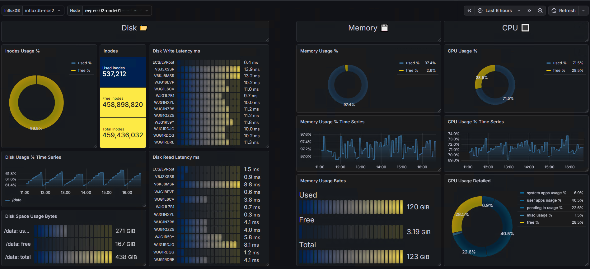

# ECS InfluxDB Exporter

**A lightweight multi-node Prometheus exporter for Dell EMC ECS environments that retrieves ECS infrastructure metrics directly from the internal InfluxDB instance used by ECS monitoring.**

**The exporter exposes metrics in Prometheus format and supports scraping multiple ECS InfluxDB nodes dynamically through Prometheus relabeling.**

**The exporter is implemented as a Python WSGI application and packaged as a Docker container using Gunicorn.**

---

## Features
* Multi-node ECS monitoring through a single exporter
* Prometheus-compatible metrics endpoint
* Dockerized deployment
* Lightweight and stateless design
* Dynamic target selection using Prometheus relabeling
* Health endpoint support
* Separate Prometheus registry per scrape request
* Supports:
  * CPU metrics
  * Memory metrics
  * Disk usage metrics
  * Disk inode metrics
  * Disk latency metrics

---

## Architecture

```
Prometheus
     |
     | scrape
     v
ECS InfluxDB Exporter
     |
     | Flux Queries
     v
ECS Internal InfluxDB
```
The exporter acts similarly to a blackbox-style exporter:
* Prometheus scrapes the exporter
* Prometheus passes the target ECS InfluxDB address using query parameters
* The exporter connects to the specified ECS InfluxDB node
* Flux queries are executed
* Metrics are converted into Prometheus format

---

## Requirements
* Docker
* Prometheus
* ECS monitoring enabled
* ECS internal InfluxDB exposed and reachable from the exporter

ECS internal InfluxDB is not exposed by default so before using this exporter:

* expose the ECS InfluxDB service
* ensure network connectivity from exporter to ECS nodes
* allow access on the InfluxDB HTTP port

---

## Supported Metrics
### Disk Latency
| Metric  | Description |
| ------------- |:-------------:|
| ecs_disk_read_latency_ms      | Average disk read latency     |
| ecs_disk_write_latency_ms      | Average disk write latency     |

### Labels
* node
* disk
* disk_type
* influx_addr
#
### Disk Usage
| Metric  | Description |
| ------------- |:-------------:|
| ecs_disk_usage_bytes      | Used disk space in Bytes     |
| ecs_disk_free_bytes      | Free disk space in Bytes    |
| ecs_disk_total_bytes      | Total disk space in Bytes    |
| ecs_disk_usage_percent      | Disk usage percentage    |

### Labels
* node
* path
* influx_addr
#
### Disk Inodes
| Metric  | Description |
| ------------- |:-------------:|
| ecs_disk_inodes_used      | Used inodes     |
| ecs_disk_inodes_free      | Free inodes    |
| ecs_disk_inodes_total      | Total inodes    |
	
### Labels
* node
* path
* influx_addr
#
### CPU Metrics
| Metric  | Description |
| ------------- |:-------------:|
| ecs_cpu_usage_iowait      | CPU iowait usage percentage     |
| ecs_cpu_usage_system      | CPU system usage percentage    |
| ecs_cpu_usage_user      | CPU user usage percentage    |
| ecs_cpu_usage_percent      | Total CPU usage percentage    |

### Labels
* node
* influx_addr
#
### Memory Metrics
| Metric  | Description |
| ------------- |:-------------:|
| ecs_memory_total_bytes      | Total memory in Bytes    |
| ecs_memory_used_bytes      | Used memory in Bytes    |
| ecs_memory_free_bytes      | Free memory in Bytes    |	

### Labels
* node
* influx_addr

---

## Grafana Dashboard



---

## Docker Deployment
### Docker Run
```bash
docker run -d \
  --name ecs-influxdb-exporter \
  -p 9545:9545 \
  --restart unless-stopped \
  vnk-nexus.abramad.com:5000/ecs-influxdb-exporter:1.0
```

### Docker Compose
```yml
services:
  ecs-influxdb-exporter:
    image: vnk-nexus.abramad.com:5000/ecs-influxdb-exporter:1.0
    container_name: ecs-influxdb-exporter

    ports:
      - "9545:9545"

    restart: unless-stopped

    mem_limit: 256m
    cpus: 0.5
```

Start:
```bash
docker compose up -d
```

---

## Prometheus Configuration

### Scrape
Example Prometheus scrape configuration:
```yml
- job_name: "ecs_influx_exporter"
  metrics_path: /metrics

  static_configs:
    - targets:
        - 172.17.18.238:18086
      labels:
        team: storage
        subteam: storage_san
        influx_name: influxdb-ecs1

    - targets:
        - 172.17.18.233:18086
      labels:
        team: storage
        subteam: storage_san
        influx_name: influxdb-ecs2

  relabel_configs:
    - source_labels: [__address__]
      target_label: __param_target

    - target_label: __address__
    # Replace with your Exporter Instance Address
      replacement: localhost:9545
```
### How It Works

Prometheus rewrites the target address into the target query parameter.

Example generated request:

```bash
curl "http://localhost:9545/metrics?target=172.17.13.248:18086"
```
The exporter then:

* Connects to the target ECS InfluxDB instance
* Executes Flux queries
* Converts results into Prometheus metrics
* Returns scrape results
* Endpoints
* Metrics Endpoint
* /metrics?target=<ecs-influxdb-host:port>

Example:
```bash
curl "http://exporter-instance-addr:9545/metrics?target=172.17.13.248:18086"
Health Endpoint
curl http://exporter-instance-addr:9545/health
```

Response:
```bash
OK
```

### Alert Rules
Example Prometheus alert rule configuration:
```yml
groups:
- name: emc_alerts
## Up ##
  - alert: ECSInfluxdbScrapeFailed
    expr: up{job='ecs_influx_exporter'} != 1
    for: 5m
    labels:
      severity: critical
      type: prod
      channel: sms
      team: csb
      subteam: csb_storage_sds
    annotations:
      summary: EMC InfluxDB Metric Collection Failed
      description: |
        InfluxDB:     {{ $labels.influx_name }}
        Job:          {{ $labels.job }}

  ## Memory ##
  - alert: ECSNodeMemoryUsageVeryHigh
    expr: 100 - (ecs_memory_free_bytes / ecs_memory_total_bytes * 100) > 95
    for: 5m
    labels:
      severity: critical
      channel: sms
      team: csb
      subteam: csb_storage_sds
      type: prod
    annotations:
      summary: EMC Node {{ $labels.node }} Memory Usage Over 95%
      description: |
        Node:           {{ $labels.node }}
        InfluxDB Name:  {{ $labels.influx_name }}
        InfluxDB Addr:  {{ $labels.influx_addr }}
        Value:          {{ printf "%.2f" $value }}%

  - alert: ECSNodeMemoryUsageHigh
    expr: 100 - (ecs_memory_free_bytes / ecs_memory_total_bytes * 100) > 85
    for: 5m
    labels:
      severity: warning
      team: csb
      subteam: csb_storage_sds
      type: prod
    annotations:
      summary: EMC Node {{ $labels.node }} Memory Usage Over 85%
      description: |
        Node:           {{ $labels.node }}
        InfluxDB Name:  {{ $labels.influx_name }}
        InfluxDB Addr:  {{ $labels.influx_addr }}
        Value:          {{ printf "%.2f" $value }}%

  ## CPU ##
  - alert: ECSNodeCPUUsageVeryHigh
    expr: ecs_cpu_usage_percent > 90
    for: 5m
    labels:
      severity: critical
      channel: sms
      team: csb
      subteam: csb_storage_sds
      type: prod
    annotations:
      summary: EMC Node {{ $labels.node }} CPU Usage Over 90%
      description: |
        Node:           {{ $labels.node }}
        InfluxDB Name:  {{ $labels.influx_name }}
        InfluxDB Addr:  {{ $labels.influx_addr }}
        Value:          {{ printf "%.2f" $value }}%

  - alert: ECSNodeCPUUsageHigh
    expr: ecs_cpu_usage_percent > 80
    for: 5m
    labels:
      severity: warning
      team: csb
      subteam: csb_storage_sds
      type: prod
    annotations:
      summary: EMC Node {{ $labels.node }} CPU Usage Over 80%
      description: |
        Node:           {{ $labels.node }}
        InfluxDB Name:  {{ $labels.influx_name }}
        InfluxDB Addr:  {{ $labels.influx_addr }}
        Value:          {{ printf "%.2f" $value }}%

  ## inode ##
  - alert: ECSNodeInodeUsageVeryHigh
    expr: (ecs_disk_inodes_used / ecs_disk_inodes_total) * 100 > 90
    for: 5m
    labels:
      severity: critical
      channel: sms
      team: csb
      subteam: csb_storage_sds
      type: prod
    annotations:
      summary: EMC Node {{ $labels.node }} inode Usage in {{ $labels.path }} Over 90%
      description: |
        Node:           {{ $labels.node }}
        Path:           {{ $labels.path }}
        InfluxDB Name:  {{ $labels.influx_name }}
        InfluxDB Addr:  {{ $labels.influx_addr }}
        Value:          {{ printf "%.2f" $value }}%

  - alert: ECSNodeInodeUsageHigh
    expr: (ecs_disk_inodes_used / ecs_disk_inodes_total) * 100 > 80
    for: 5m
    labels:
      severity: warning
      team: csb
      subteam: csb_storage_sds
      type: prod
    annotations:
      summary: EMC Node {{ $labels.node }} inode Usage in {{ $labels.path }} Over 80%
      description: |
        Node:           {{ $labels.node }}
        Path:           {{ $labels.path }}
        InfluxDB Name:  {{ $labels.influx_name }}
        InfluxDB Addr:  {{ $labels.influx_addr }}
        Value:          {{ printf "%.2f" $value }}%
  
  ## Disk Usage ##
  - alert: ECSNodeDiskUsageVeryHigh
    expr: ecs_disk_usage_percent > 90
    for: 5m
    labels:
      severity: critical
      channel: sms
      team: csb
      subteam: csb_storage_sds
      type: prod
    annotations:
      summary: EMC Node {{ $labels.node }} Disk Usage in {{ $labels.path }} Over 90%
      description: |
        Node:           {{ $labels.node }}
        Path:           {{ $labels.path }}
        InfluxDB Name:  {{ $labels.influx_name }}
        InfluxDB Addr:  {{ $labels.influx_addr }}
        Value:          {{ printf "%.2f" $value }}%

  - alert: ECSNodeDiskUsageHigh
    expr: ecs_disk_usage_percent > 80
    for: 5m
    labels:
      severity: warning
      team: csb
      subteam: csb_storage_sds
      type: prod
    annotations:
      summary: EMC Node {{ $labels.node }} Disk Usage in {{ $labels.path }} Over 80%
      description: |
        Node:           {{ $labels.node }}
        Path:           {{ $labels.path }}
        InfluxDB Name:  {{ $labels.influx_name }}
        InfluxDB Addr:  {{ $labels.influx_addr }}
        Value:          {{ printf "%.2f" $value }}%

  ## Disk Latency ##
  ## Read ##
  - alert: ECSNodeDiskReadLatencyVeryHigh
    expr: ecs_disk_read_latency_ms > 20
    for: 15m
    labels:
      severity: critical
      channel: sms
      team: csb
      subteam: csb_storage_sds
      type: prod
    annotations:
      summary: EMC Node {{ $labels.node }} Disk Read Latency on {{ $labels.disk }} Over 20ms for 15m
      description: |
        Node:           {{ $labels.node }}
        Disk Name:      {{ $labels.disk }}
        Disk Type:      {{ $labels.disk_type }}
        InfluxDB Name:  {{ $labels.influx_name }}
        InfluxDB Addr:  {{ $labels.influx_addr }}
        Value:          {{ printf "%.2f" $value }}%

  - alert: ECSNodeDiskReadLatencyHigh
    expr: ecs_disk_read_latency_ms > 15
    for: 15m
    labels:
      severity: warning
      team: csb
      subteam: csb_storage_sds
      type: prod
    annotations:
      summary: EMC Node {{ $labels.node }} Disk Read Latency on {{ $labels.disk }} Over 15ms for 15m
      description: |
        Node:           {{ $labels.node }}
        Disk Name:      {{ $labels.disk }}
        Disk Type:      {{ $labels.disk_type }}
        InfluxDB Name:  {{ $labels.influx_name }}
        InfluxDB Addr:  {{ $labels.influx_addr }}
        Value:          {{ printf "%.2f" $value }}%

  ## Write ##
  - alert: ECSNodeDiskWriteLatencyVeryHigh
    expr: ecs_disk_write_latency_ms > 20
    for: 15m
    labels:
      severity: critical
      channel: sms
      team: csb
      subteam: csb_storage_sds
      type: prod
    annotations:
      summary: EMC Node {{ $labels.node }} Disk Write Latency on {{ $labels.disk }} Over 20ms for 15m
      description: |
        Node:           {{ $labels.node }}
        Disk Name:      {{ $labels.disk }}
        Disk Type:      {{ $labels.disk_type }}
        InfluxDB Name:  {{ $labels.influx_name }}
        InfluxDB Addr:  {{ $labels.influx_addr }}
        Value:          {{ printf "%.2f" $value }}%

  - alert: ECSNodeDiskWriteLatencyHigh
    expr: ecs_disk_write_latency_ms > 15
    for: 15m
    labels:
      severity: warning
      team: csb
      subteam: csb_storage_sds
      type: prod
    annotations:
      summary: EMC Node {{ $labels.node }} Disk Write Latency on {{ $labels.disk }} Over 15ms for 15m
      description: |
        Node:           {{ $labels.node }}
        Disk Name:      {{ $labels.disk }}
        Disk Type:      {{ $labels.disk_type }}
        InfluxDB Name:  {{ $labels.influx_name }}
        InfluxDB Addr:  {{ $labels.influx_addr }}
        Value:          {{ printf "%.2f" $value }}%

```

---

## Internal Configuration

Current bucket used by the exporter:
```bash
BUCKET = "monitoring_op"
```

## Gunicorn Configuration

The container starts the exporter using:

```bash
gunicorn \
  -w 2 \
  --threads 4 \
  --timeout 15 \
  -b 0.0.0.0:9545 \
  ecs_influxdb_exporter:app
  ```

## Troubleshooting
| Error Code | Error Message | Possible Reasons |
|:-------------:|:-------------:|:-------------:|
| 400 | Bad Request | Missing target parameter, target query parameter was not provided    |
| 500 | Internal Server Error | <div>ECS InfluxDB unreachable</div><div>Incorrect target port</div><div>ECS monitoring disabled Flux query failure</div><div>Missing bucket</div><div>Timeout while querying InfluxDB</div>|

## Dependencies

Python packages:
* influxdb-client
* prometheus-client
* gunicorn

---

## License

Internal / private project.